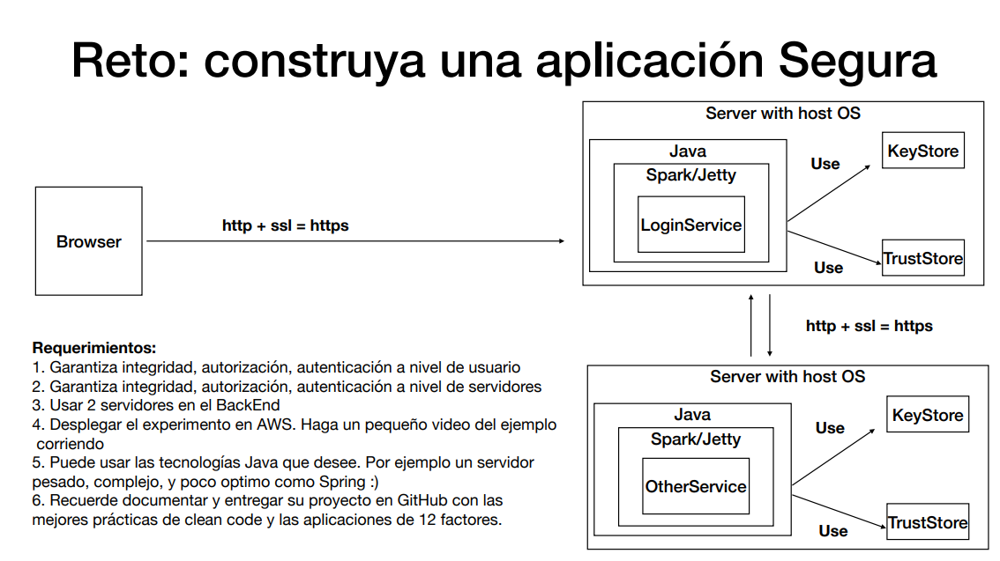
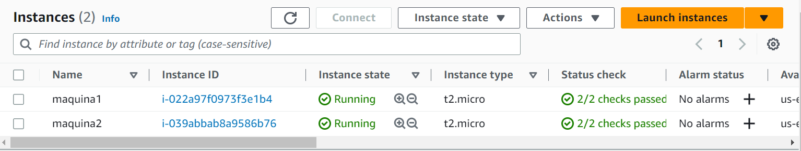
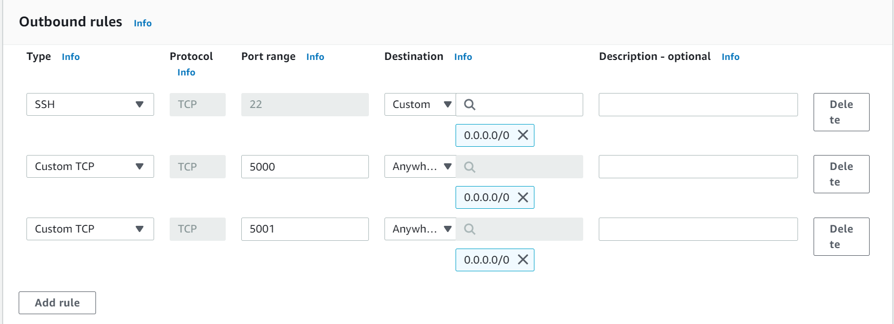
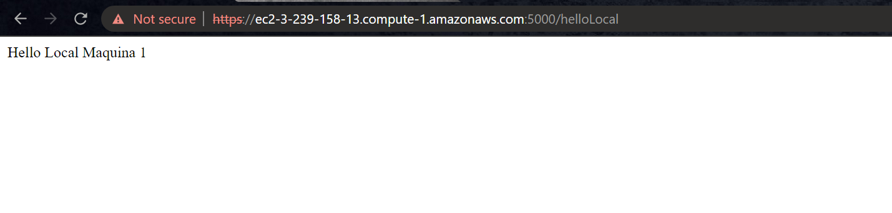
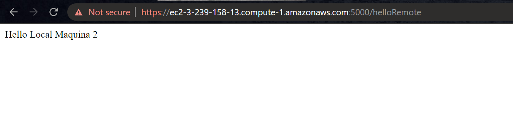

# Taller 6 AREP

## Información del programa y Arquitectura 💾



## Para utilizar el proyecto 👩‍💻

1. Debes clonar el proyecto haciendo uso del comando:
```
git clone https://github.com/gabriela-castro-s/AREP-TALLER-6.git
```

2. Posteriormente, debemos crear 3 instancias en AWS y modificamos los grupos de seguridad:
   
   

3. Nos conectamos a cada una de ellas e instalamos java con el siguiente comando, posteriormente verificamos
   que la instalación haya sido exitosa:
```
//Esta linea de conección nos la da AWS
ssh -i "key.pem" ec2-100-26-5-64.compute-1.amazonaws.com

//Instalamos java
sudo yum install java-17-amazon-corretto-devel

//Verificamos que fue instalado
java -version
```

4. Ponemos en nuestra maquina la carpeta target comprimida, para esto primero se debe generar, adicional a esto, debemos adicionar la carpeta certificates:
```
// Para pasar archivos entre nuestro directorio local y la maquina
sftp -i "key.pem" ec2-100-26-5-64.compute-1.amazonaws.com

//Para mover el archivo al directorio de la maquina
 put target.zip
 
//Para salirnos
exit
```

5. Nuevamente nos conectamos a la maquina virtual y hacemos uso de los siguientes comandos:
```
// Para descomprimir la carpeta
unzip target.zip

//Para correr HelloSecureSpark1.java
java -cp "target/classes:target/dependency/*" org.example.HelloSpark1

```

6. Podemos acceder a la aplicación usando el link de aws de la máquina:

```
// /helloLocal para conectarnos con la máquina 1
https://ec2-3-239-158-13.compute-1.amazonaws.com:5001/helloLocal
```


```
// /helloLocal para conectarnos con la máquina 2
https://ec2-3-239-158-13.compute-1.amazonaws.com:5001/helloRemote

```


## Información Adicional
- Para generar las llaves

```
keytool -genkeypair -alias ecikeypair -keyalg RSA -keysize 2048 -storetype PKCS12 -keystore ecikeystore2.p12 -validity 3650 
keytool -storetype PKCS12 -export -keystore ./ecikeystore2.p12 -alias ecikeypair -file ecicert2.cer 
keytool -storetype PKCS12 -import -file ../certificates/ecicert2.cer -alias firstCA -keystore myTrustStore1.p12
```
- Video demostración
  [](https://youtu.be/3inPELH-YfQ)


## Requisitos 📋
- Java: Ambiente de desarrollo
- Maven: Administrador del ciclo de vida del Proyecto
- Git: Controlador de versiones
- AWS: Para la creación de las instancias

## Construido con 🛠️

IntelliJ IDEA 2022.3.2 (Community Edition)

## Autores ✒️

* **Gabriela Castro Santamaría** [gabriela-castro-s](https://github.com/gabriela-castro-s) 